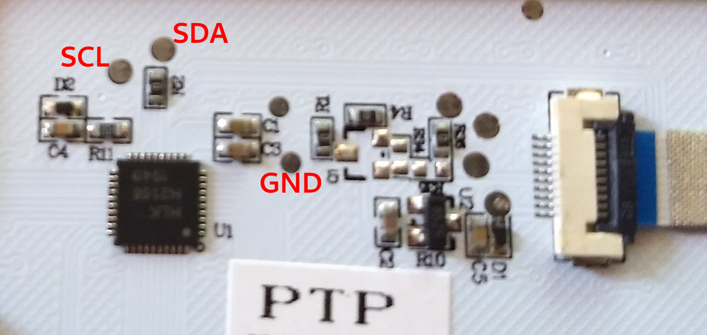

# Pinebook Pro Keyboard Firmware

The Pinebook Pro's (PBP) keyboard firmware source isn't available, so this is a
collection of information and code that may assist in writing something from 
scratch, with the eventual goal of running QMK.

## Replacement Firmware

Some issues in the stock firmware have been addressed with the 
`default_<type>.hex` files. You can flash these files, after cloning and
compiling:

    sudo ./updater flash-kb firmware/default_ansi.hex

or

    sudo ./updater flash-kb firmware/default_iso.hex

No reboot is required for these changes to take effect, but ocassionally a
reboot is required to wake the keyboard's controller back up - an unresponsive
touchpad/keyboard after flashing is usually a symptom of this. The changes to
the firmware .hex files are described in their respective `src/keymaps/*.c`
files.

You can find the labels and addresses by looking in [`fw_ansi.a51`]
(fw_ansi.a51) (assembly)
and [`src/main.c`](src/main.c) (c pseudo code written by hand) and
[`src/revised.c`](src/revised.c) (common code for all keymaps).

## Hardware

The PBP uses the SH68F83 made by Sinowealth. The data sheet is the 
[sinowealth-sh68f83-datasheet-v2.pdf](/firmware/docs/sinowealth-sh68f83-datasheet-v2.pdf) file in the `docs` directory. 
It has the following test points on the main board that may be useful, taken from the [PBP mainboard 
schematic, v2.1](http://files.pine64.org/doc/PinebookPro/pinebookpro_v2.1_mainboard_schematic.pdf):

    T27: 5V, VDD on the keyboard MCU 
    T33: D+ between the 22R and the keyboard MCU 
    T41: D- between the 22R and the keyboard MCU 
    T49: LED4 sink (LED0 on the chip, pin 37, P40) 
    T47: LED3 sink (LED1 on the chip, pin 38, P41) 
    T45: NC  (LED2 on the chip, pin 39, P42) 
    T38: Ground

The touchpad is connected to the keyboard MCU via I2C (and only this - the replacement 
firmware will need to handle this) and has these test points, which are 
connected directly to the TP connector: 

    T60: 3.3V, VCC 
    T61: SDA 
    T62: SCL 
    T63: INT 
    T65: Ground

The I2C bus consists of the keyboard MCU as master. There are two devices on the bus: The touchpad
and an EEPROM that persists the state of the WiFi/Microphone/Camera kill switches.

These test points can be found on the mainboard by looking at the silkscreen of
the top and bottom:

* https://wiki.pine64.org/images/3/30/Pinebookpro-v2.1-top-ref.pdf
* https://wiki.pine64.org/images/b/b7/Pinebookpro-v2.1-bottom-ref.pdf

## Keyboard Connector

The rows and columns of the keyboard are mapped out to the 28p FPC connector - 
it should be noted that the last two positions are unused (this is only clear 
from viewing the keyborad's cable), meaning a 26p cable could be used for 
development/replacements. All of the positions of the connector have test
points.

P26 of the connector is the Power button, which gets shorted to Ground (P25) to
power on the PBP. This also has its own test point at `T64`. 

## Hardware Cuts

The MIC_CUT, WIFI_CUT, and CAM_CUT seem to be wired directly to the keyboard MCU
with out any test points. These items are disabled when these pins are pulled
down, and have the following mapping:

    P31: MIC_CUT
    P36: WIFI_CUT
    P37: CAM_CUT

The keyboard MCU is connected to an EEPROM that persists the states of each cut. In the
factory firmware, only the first byte is used, with each cut corresponding to one of the
3 least significant bits.

## Decompiling

The hex files provided by the manufacturer have been decompiled using `dis51`, 
and are included in this directory as well.

The HID country code has been changed in the hex file by @salcedo here: https://github.com/salcedo/pinebook-pro-keyboard-updater/commit/cbcdc89c4fd519d81b10396ac58ea13921c9d387

Some effort has been made to trace through the assembly calls in fw_ansi.a51,
and outlined in src/main.c. Things like the matrix scan and i2c management
have been identified. I don't completed understand which calls get added to the
stack, so some return statements may be incorrect.

## Test Firmware

The keymap section of the hex file has been identified and commenting has begun
in `fw_ansi.a51`. Right now the edits to `fw_ansi_test.hex` have been manual
using a tool like https://www.fischl.de/hex_checksum_calculator/?

The keymap is also being written here for easier readability:
https://docs.google.com/spreadsheets/d/147NwY3otNitE4M7xduihfY5SpRrhwBLPGwOp8qG5uA8/edit?usp=sharing
- feel free to request access if you'd like to contribute additional data
locations.

## HID Descriptor

https://eleccelerator.com/usbdescreqparser/ was used to parse the usb stuff.
https://sourceforge.net/projects/hidrdd/ can generate headers based on the
descriptors.

## I2C Captures

The replacement firmware will need to be able to handle the touchpad interrupt, read its registers, and
present the touchpad reports to a USB endpoint. It will also have to handle updating of the touchpad firmware.
To better understand how the MCU interacts with the touchpad, captures of I2C traffic have been provided by
C_Elgens from the [Pine64 Forum](https://forum.pine64.org/showthread.php?pid=56938#pid56938). 

They are in [DSView](https://github.com/DreamSourceLab/DSView) format. DSView can export decoded I2C to a CSV file.

C_Elgens also described what actions were being done on the touchpad during each capture.

| File                                                               | Description                                                |
|--------------------------------------------------------------------|------------------------------------------------------------|
| [click.dsl](/firmware/docs/i2c-captures/click.dsl)                 | A single click using the mouse button                      |
| [drag.dsl](/firmware/docs/i2c-captures/drag.dsl)                   | Me dragging my finger around for a few seconds             |
| [i2c1.dsl](/firmware/docs/i2c-captures/i2c1.dsl)                   | Random clicks, drags, and taps                             |
| [start1.dsl](/firmware/docs/i2c-captures/start1.dsl)               | Recording of the i2c activity on laptop startup            |
| [start2.dsl](/firmware/docs/i2c-captures/start2.dsl)               | Same as start1                                             |
| [tap.dsl](/firmware/docs/i2c-captures/tap.dsl)                     | A single tap                                               |
| [updater-step1.dsl](/firmware/docs/i2c-captures/updater-step1.dsl) | The i2c activity while running step1 of the update utility |
| [updater-step2.dsl](/firmware/docs/i2c-captures/updater-step2.dsl) | The i2c activity while running step2 of the update utility |

## Touchpad

Currently, not much is known about the touchpad IC (part no. HLK H2168). From the I2C captures, we know that its
firmware is written (sans some header/checksum information at the end of tpfw.bin) to an EEPROM addressable at 0x1A
on the I2C. The update protocol is trivial, and can be fully understood from the updater-step2.dsl capture.
